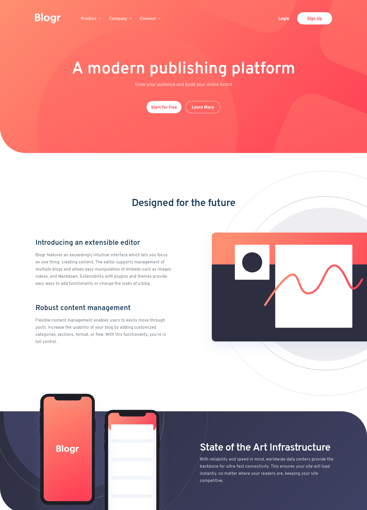

# Frontend Mentor - Blogr landing page solution

This is a solution to the [Blogr landing page challenge on Frontend Mentor](https://www.frontendmentor.io/challenges/blogr-landing-page-EX2RLAApP). Frontend Mentor challenges help you improve your coding skills by building realistic projects. 

## Table of contents

- [Overview](#overview)
  - [The challenge](#the-challenge)
  - [Screenshot](#screenshot)
  - [Links](#links)
- [What I learned](#what-i-learned)
  - [Built with](#built-with)
  - [Useful resources](#useful-resources)
- [Author](#author)

## Overview

### The challenge

Users should be able to:

- View the optimal layout for the site depending on their device's screen size
- See hover states for all interactive elements on the page

### Screenshot




### Links

- Solution URL: [Add solution URL here](https://your-solution-url.com)
- Live Site URL: [Add live site URL here](https://your-live-site-url.com)

### Built with

- Semantic HTML5 markup
- Component-Scoped Styles with CSS Modules
- Flexbox
- CSS Grid
- Mobile-first workflow
- [React](https://reactjs.org/) - JS library

### What I learned

This project proved to be quite challenging in many small ways. From layered images to animations within the navigation, there were many opportunities to learn something new.

Starting with the navigation, I wanted to be able to click an item on the navbar, have a menu appear, then be able to click away from the menu to make it disappear. This in itself
took a while to conceptualize, and I knew it would be a job for the useEffect React hook, as well as the forwardRef hook to 
ensure clicking on the menu HTML element itself did not make it close:

```js
  useEffect(() => {
    const handleClickOutside = (event) => {
      if (
        navItemRef.current &&
        menuActive &&
        !navItemRef.current.contains(event.target)
      ) {
        handleMenuActive();
      }
    };
    document.addEventListener("mousedown", handleClickOutside);
    return () => {
      document.removeEventListener("mousedown", handleClickOutside);
    };
  });
```

I had to ensure the menu was first active in order to close it to prevent the menus from opening upon clicking anywhere on the screen, since handleMenuActive() simply toggles the menu.

I found a very useful react media query module called 'react-responsive' that was super simple to use to determine when to change the navigation from desktop to mobile. It allowed me to created a variable that I can then reference to let React know
when to render the mobile navigation and vice versa: 
```js
const isMobile = useMediaQuery({ maxWidth: 768 });

return (
{!isMobile ....... }
{isMobile ........ }
);
```

When dealing with the header and divider background images and linear-gradient, I had learned that you can have multiple background images/gradients on a single background! Not only are you able to set them, but you can also individually control various properties of each. This came in use when working on these two sections of the website, considering they have both an SVG and a gradient. Before I knew this, every time I would try and change the positioning of the SVG, the background gradient would disappear.

```css
  background: url("../../assets/bg-pattern-circles.svg"),
    linear-gradient(135deg, #2d2e40 0%, #3f4164 100%);
  background-repeat: no-repeat;
  background-size: 602px auto, 100% 100%;
  background-position: center -280px, 0px 0px;
```

When implementing layered images into a website, I was always a bit confused as to how to approach the design. However, this project really helped further my skills in positioning images within the page! Though frustrated at times, I am happy with the end result.


### Useful resources

- [Kevin Powell's Youtube Channel](https://www.youtube.com/kevinpowell) - Seriously, this guy is great. I love his videos. CSS is confusing because it's behavior is so strange! Kevin addresses that and is amazing at clarifying why CSS does what it does.

## Author

- Frontend Mentor - [@tkressma](https://www.frontendmentor.io/profile/tkressma)
- Twitter - [@tom_kressman](https://www.twitter.com/tom_kressman)

